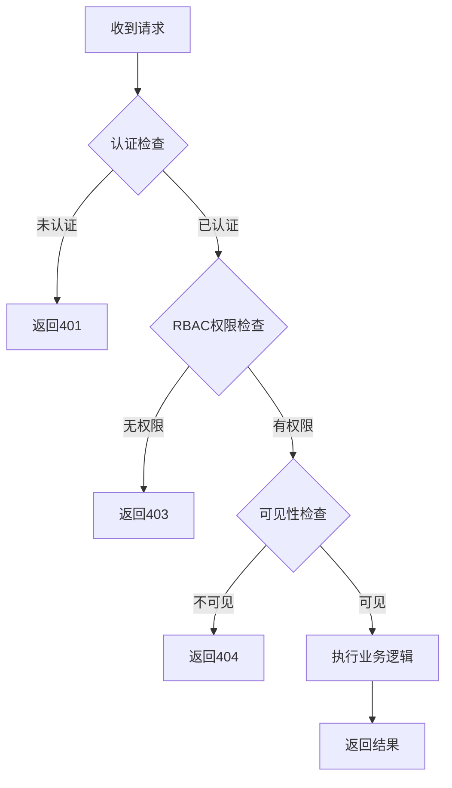

# Ticket System - Permission Guide
# 工单系统 - 权限配置指南

## 目录

1. [概述](#1-概述)
2. [Casbin 策略配置](#2-casbin-策略配置)
3. [角色权限映射](#3-角色权限映射)
4. [可见性检查实现](#4-可见性检查实现)
5. [权限中间件](#5-权限中间件)
6. [权限测试用例](#6-权限测试用例)
7. [常见权限场景](#7-常见权限场景)

---

## 1. 概述

### 1.1 权限模型

工单系统采用 **RBAC (Role-Based Access Control)** 模型结合 **可见性规则**：

- **RBAC**: 基于角色的权限控制，决定用户能执行哪些操作
- **可见性**: 基于业务规则，决定用户能看到哪些工单

### 1.2 权限层次

```
认证层 (Authentication)
    ↓
授权层 (Authorization - RBAC)
    ↓
可见性层 (Visibility Rules)
    ↓
业务逻辑层
```

### 1.3 三种角色

| 角色 | Slug | 权限范围 | 典型用户 |
|------|------|----------|----------|
| User | `user` | 基础权限：创建和管理自己的工单 | 普通用户、客户 |
| Agent | `agent` | 扩展权限：处理分配的工单、更新状态 | 客服人员、技术支持 |
| Admin | `admin` | 完整权限：管理所有工单和系统配置 | 系统管理员、主管 |

---

## 2. Casbin 策略配置

### 2.1 Model 配置

**文件**: `/Users/easayliu/Documents/go/orris/configs/casbin/model.conf`

```ini
[request_definition]
r = sub, obj, act

[policy_definition]
p = sub, obj, act

[role_definition]
g = _, _

[policy_effect]
e = some(where (p.eft == allow))

[matchers]
m = g(r.sub, p.sub) && r.obj == p.obj && r.act == p.act
```

### 2.2 Policy 配置

**文件**: `/Users/easayliu/Documents/go/orris/configs/casbin/policy.csv`

```csv
# Role Policies - User
p, user, ticket, create
p, user, ticket, read
p, user, ticket, update
p, user, ticket, comment
p, user, ticket, reopen

# Role Policies - Agent
p, agent, ticket, create
p, agent, ticket, read
p, agent, ticket, update
p, agent, ticket, assign
p, agent, ticket, close
p, agent, ticket, reopen
p, agent, ticket, comment
p, agent, ticket, internal_note

# Role Policies - Admin
p, admin, ticket, create
p, admin, ticket, read
p, admin, ticket, read_all
p, admin, ticket, update
p, admin, ticket, delete
p, admin, ticket, assign
p, admin, ticket, close
p, admin, ticket, reopen
p, admin, ticket, comment
p, admin, ticket, internal_note

# Role Inheritance (if needed)
# g, agent, user
# g, admin, agent
```

### 2.3 动态策略加载

**文件**: `/Users/easayliu/Documents/go/orris/internal/infrastructure/auth/casbin_enforcer.go`

```go
package auth

import (
	"fmt"

	"github.com/casbin/casbin/v2"
	gormadapter "github.com/casbin/gorm-adapter/v3"
	"gorm.io/gorm"
)

// CasbinEnforcer wraps Casbin enforcer
type CasbinEnforcer struct {
	enforcer *casbin.Enforcer
}

// NewCasbinEnforcer creates a new Casbin enforcer
func NewCasbinEnforcer(db *gorm.DB, modelPath string) (*CasbinEnforcer, error) {
	adapter, err := gormadapter.NewAdapterByDB(db)
	if err != nil {
		return nil, fmt.Errorf("failed to create casbin adapter: %w", err)
	}

	enforcer, err := casbin.NewEnforcer(modelPath, adapter)
	if err != nil {
		return nil, fmt.Errorf("failed to create casbin enforcer: %w", err)
	}

	// Load policies from database
	if err := enforcer.LoadPolicy(); err != nil {
		return nil, fmt.Errorf("failed to load policies: %w", err)
	}

	return &CasbinEnforcer{
		enforcer: enforcer,
	}, nil
}

// Enforce checks if a user has permission
func (e *CasbinEnforcer) Enforce(userRole, resource, action string) (bool, error) {
	return e.enforcer.Enforce(userRole, resource, action)
}

// AddPolicy adds a new policy
func (e *CasbinEnforcer) AddPolicy(userRole, resource, action string) error {
	_, err := e.enforcer.AddPolicy(userRole, resource, action)
	return err
}

// RemovePolicy removes a policy
func (e *CasbinEnforcer) RemovePolicy(userRole, resource, action string) error {
	_, err := e.enforcer.RemovePolicy(userRole, resource, action)
	return err
}

// AddRoleForUser adds a role for user
func (e *CasbinEnforcer) AddRoleForUser(userID uint, role string) error {
	userIDStr := fmt.Sprintf("user:%d", userID)
	_, err := e.enforcer.AddGroupingPolicy(userIDStr, role)
	return err
}

// GetRolesForUser gets all roles for a user
func (e *CasbinEnforcer) GetRolesForUser(userID uint) ([]string, error) {
	userIDStr := fmt.Sprintf("user:%d", userID)
	return e.enforcer.GetRolesForUser(userIDStr)
}
```

### 2.4 初始化策略

**文件**: `/Users/easayliu/Documents/go/orris/cmd/init_permissions.go`

```go
package main

import (
	"log"

	"orris/internal/infrastructure/auth"
	"orris/internal/infrastructure/database"
)

func main() {
	// Connect to database
	db, err := database.NewConnection()
	if err != nil {
		log.Fatalf("Failed to connect to database: %v", err)
	}

	// Create enforcer
	enforcer, err := auth.NewCasbinEnforcer(db, "./configs/casbin/model.conf")
	if err != nil {
		log.Fatalf("Failed to create enforcer: %v", err)
	}

	// Initialize policies for User role
	userPolicies := [][]string{
		{"user", "ticket", "create"},
		{"user", "ticket", "read"},
		{"user", "ticket", "update"},
		{"user", "ticket", "comment"},
		{"user", "ticket", "reopen"},
	}

	for _, policy := range userPolicies {
		if err := enforcer.AddPolicy(policy[0], policy[1], policy[2]); err != nil {
			log.Printf("Failed to add policy %v: %v", policy, err)
		}
	}

	// Initialize policies for Agent role
	agentPolicies := [][]string{
		{"agent", "ticket", "create"},
		{"agent", "ticket", "read"},
		{"agent", "ticket", "update"},
		{"agent", "ticket", "assign"},
		{"agent", "ticket", "close"},
		{"agent", "ticket", "reopen"},
		{"agent", "ticket", "comment"},
		{"agent", "ticket", "internal_note"},
	}

	for _, policy := range agentPolicies {
		if err := enforcer.AddPolicy(policy[0], policy[1], policy[2]); err != nil {
			log.Printf("Failed to add policy %v: %v", policy, err)
		}
	}

	// Initialize policies for Admin role
	adminPolicies := [][]string{
		{"admin", "ticket", "create"},
		{"admin", "ticket", "read"},
		{"admin", "ticket", "read_all"},
		{"admin", "ticket", "update"},
		{"admin", "ticket", "delete"},
		{"admin", "ticket", "assign"},
		{"admin", "ticket", "close"},
		{"admin", "ticket", "reopen"},
		{"admin", "ticket", "comment"},
		{"admin", "ticket", "internal_note"},
	}

	for _, policy := range adminPolicies {
		if err := enforcer.AddPolicy(policy[0], policy[1], policy[2]); err != nil {
			log.Printf("Failed to add policy %v: %v", policy, err)
		}
	}

	log.Println("Permissions initialized successfully!")
}
```

---

## 3. 角色权限映射

### 3.1 完整权限矩阵

| 操作 | Resource | Action | User | Agent | Admin | 说明 |
|------|----------|--------|------|-------|-------|------|
| **工单操作** |
| 创建工单 | `ticket` | `create` | ✅ | ✅ | ✅ | 所有用户都可创建 |
| 查看工单 | `ticket` | `read` | ✅ | ✅ | ✅ | 需通过可见性检查 |
| 查看所有工单 | `ticket` | `read_all` | ❌ | ❌ | ✅ | 仅管理员 |
| 更新工单 | `ticket` | `update` | ✅ | ✅ | ✅ | User仅限自己创建的 |
| 删除工单 | `ticket` | `delete` | ❌ | ❌ | ✅ | 仅管理员 |
| **状态管理** |
| 分配工单 | `ticket` | `assign` | ❌ | ✅ | ✅ | Agent/Admin |
| 关闭工单 | `ticket` | `close` | ❌ | ✅ | ✅ | Agent/Admin |
| 重开工单 | `ticket` | `reopen` | ✅ | ✅ | ✅ | 创建人或处理人 |
| **评论操作** |
| 添加评论 | `ticket` | `comment` | ✅ | ✅ | ✅ | 可见者都可评论 |
| 内部备注 | `ticket` | `internal_note` | ❌ | ✅ | ✅ | 仅Agent/Admin |

### 3.2 权限检查流程图



---

## 4. 可见性检查实现

### 4.1 可见性服务

**文件**: `/Users/easayliu/Documents/go/orris/internal/application/ticket/services/visibility_checker.go`

```go
package services

import (
	"context"

	"orris/internal/domain/ticket"
	"orris/internal/shared/logger"
)

// VisibilityChecker checks ticket visibility for users
type VisibilityChecker struct {
	logger logger.Interface
}

// NewVisibilityChecker creates a new visibility checker
func NewVisibilityChecker(logger logger.Interface) *VisibilityChecker {
	return &VisibilityChecker{
		logger: logger,
	}
}

// CanView checks if a user can view a ticket
func (vc *VisibilityChecker) CanView(
	ctx context.Context,
	userID uint,
	userRoles []string,
	t *ticket.Ticket,
) bool {
	// Rule 1: Admin can view all tickets
	if vc.hasRole(userRoles, "admin") {
		vc.logger.Debugw("admin can view all tickets",
			"user_id", userID,
			"ticket_id", t.ID())
		return true
	}

	// Rule 2: Creator can view own tickets
	if t.CreatorID() == userID {
		vc.logger.Debugw("creator can view own ticket",
			"user_id", userID,
			"ticket_id", t.ID())
		return true
	}

	// Rule 3: Assignee can view assigned tickets
	if t.AssigneeID() != nil && *t.AssigneeID() == userID {
		vc.logger.Debugw("assignee can view assigned ticket",
			"user_id", userID,
			"ticket_id", t.ID())
		return true
	}

	// Rule 4: Participants (commenters) can view tickets they commented on
	if vc.isParticipant(userID, t.Comments()) {
		vc.logger.Debugw("participant can view ticket",
			"user_id", userID,
			"ticket_id", t.ID())
		return true
	}

	// Rule 5: Agents can view tickets in their department (if implemented)
	// if vc.hasRole(userRoles, "agent") && vc.inSameDepartment(userID, t) {
	//     return true
	// }

	vc.logger.Debugw("user cannot view ticket",
		"user_id", userID,
		"ticket_id", t.ID())
	return false
}

// CanUpdate checks if a user can update a ticket
func (vc *VisibilityChecker) CanUpdate(
	ctx context.Context,
	userID uint,
	userRoles []string,
	t *ticket.Ticket,
) bool {
	// Admin can update all tickets
	if vc.hasRole(userRoles, "admin") {
		return true
	}

	// Agent can update assigned tickets
	if vc.hasRole(userRoles, "agent") {
		if t.AssigneeID() != nil && *t.AssigneeID() == userID {
			return true
		}
	}

	// Creator can update own tickets (with restrictions)
	if t.CreatorID() == userID {
		// User can only update if ticket is not closed
		return t.Status().String() != "closed"
	}

	return false
}

// CanAssign checks if a user can assign a ticket
func (vc *VisibilityChecker) CanAssign(
	ctx context.Context,
	userID uint,
	userRoles []string,
) bool {
	// Only Agent and Admin can assign tickets
	return vc.hasRole(userRoles, "agent") || vc.hasRole(userRoles, "admin")
}

// CanClose checks if a user can close a ticket
func (vc *VisibilityChecker) CanClose(
	ctx context.Context,
	userID uint,
	userRoles []string,
	t *ticket.Ticket,
) bool {
	// Admin can close any ticket
	if vc.hasRole(userRoles, "admin") {
		return true
	}

	// Agent can close assigned tickets
	if vc.hasRole(userRoles, "agent") {
		if t.AssigneeID() != nil && *t.AssigneeID() == userID {
			return true
		}
	}

	return false
}

// CanReopen checks if a user can reopen a ticket
func (vc *VisibilityChecker) CanReopen(
	ctx context.Context,
	userID uint,
	userRoles []string,
	t *ticket.Ticket,
) bool {
	// Admin can reopen any ticket
	if vc.hasRole(userRoles, "admin") {
		return true
	}

	// Creator can reopen own tickets
	if t.CreatorID() == userID {
		return true
	}

	// Agent can reopen assigned tickets
	if vc.hasRole(userRoles, "agent") {
		if t.AssigneeID() != nil && *t.AssigneeID() == userID {
			return true
		}
	}

	return false
}

// CanViewInternalNotes checks if user can view internal notes
func (vc *VisibilityChecker) CanViewInternalNotes(
	ctx context.Context,
	userRoles []string,
) bool {
	return vc.hasRole(userRoles, "agent") || vc.hasRole(userRoles, "admin")
}

// Helper: Check if user has a specific role
func (vc *VisibilityChecker) hasRole(roles []string, targetRole string) bool {
	for _, role := range roles {
		if role == targetRole {
			return true
		}
	}
	return false
}

// Helper: Check if user is a participant (commenter)
func (vc *VisibilityChecker) isParticipant(userID uint, comments []*ticket.Comment) bool {
	for _, comment := range comments {
		if comment.UserID() == userID {
			return true
		}
	}
	return false
}
```

### 4.2 在 UseCase 中集成可见性检查

**文件**: `/Users/easayliu/Documents/go/orris/internal/application/ticket/usecases/get_ticket.go`

```go
package usecases

import (
	"context"

	"orris/internal/application/ticket/services"
	"orris/internal/domain/ticket"
	"orris/internal/shared/errors"
	"orris/internal/shared/logger"
)

// GetTicketQuery represents the query to get a ticket
type GetTicketQuery struct {
	TicketID  uint
	UserID    uint
	UserRoles []string
}

// GetTicketResult represents the ticket details
type GetTicketResult struct {
	// ... ticket fields
}

// GetTicketExecutor defines the interface
type GetTicketExecutor interface {
	Execute(ctx context.Context, query GetTicketQuery) (*GetTicketResult, error)
}

// GetTicketUseCase implements getting ticket details
type GetTicketUseCase struct {
	repository        ticket.Repository
	visibilityChecker *services.VisibilityChecker
	logger            logger.Interface
}

// NewGetTicketUseCase creates a new use case
func NewGetTicketUseCase(
	repository ticket.Repository,
	visibilityChecker *services.VisibilityChecker,
	logger logger.Interface,
) *GetTicketUseCase {
	return &GetTicketUseCase{
		repository:        repository,
		visibilityChecker: visibilityChecker,
		logger:            logger,
	}
}

// Execute executes the get ticket use case
func (uc *GetTicketUseCase) Execute(
	ctx context.Context,
	query GetTicketQuery,
) (*GetTicketResult, error) {
	uc.logger.Infow("executing get ticket use case",
		"ticket_id", query.TicketID,
		"user_id", query.UserID)

	// Load ticket
	t, err := uc.repository.FindByID(ctx, query.TicketID)
	if err != nil {
		uc.logger.Errorw("failed to find ticket", "error", err)
		return nil, errors.NewNotFoundError("ticket not found")
	}

	// Check visibility
	if !uc.visibilityChecker.CanView(ctx, query.UserID, query.UserRoles, t) {
		uc.logger.Warnw("user cannot view ticket",
			"user_id", query.UserID,
			"ticket_id", query.TicketID)
		return nil, errors.NewNotFoundError("ticket not found")
	}

	// Filter internal comments if user is not agent/admin
	comments := t.Comments()
	if !uc.visibilityChecker.CanViewInternalNotes(ctx, query.UserRoles) {
		comments = uc.filterInternalComments(comments)
	}

	// Build result
	result := &GetTicketResult{
		// ... map ticket to result
	}

	return result, nil
}

func (uc *GetTicketUseCase) filterInternalComments(
	comments []*ticket.Comment,
) []*ticket.Comment {
	filtered := make([]*ticket.Comment, 0)
	for _, comment := range comments {
		if !comment.IsInternal() {
			filtered = append(filtered, comment)
		}
	}
	return filtered
}
```

---

## 5. 权限中间件

### 5.1 权限检查中间件

**文件**: `/Users/easayliu/Documents/go/orris/internal/interfaces/http/middleware/permission_middleware.go`

```go
package middleware

import (
	"net/http"

	"github.com/gin-gonic/gin"

	"orris/internal/infrastructure/auth"
	"orris/internal/shared/logger"
	"orris/internal/shared/utils"
)

// PermissionMiddleware handles permission checking
type PermissionMiddleware struct {
	enforcer *auth.CasbinEnforcer
	logger   logger.Interface
}

// NewPermissionMiddleware creates a new permission middleware
func NewPermissionMiddleware(
	enforcer *auth.CasbinEnforcer,
	logger logger.Interface,
) *PermissionMiddleware {
	return &PermissionMiddleware{
		enforcer: enforcer,
		logger:   logger,
	}
}

// RequirePermission checks if user has required permission
func (m *PermissionMiddleware) RequirePermission(
	resource string,
	action string,
) gin.HandlerFunc {
	return func(c *gin.Context) {
		// Get user roles from context (set by auth middleware)
		rolesValue, exists := c.Get("user_roles")
		if !exists {
			m.logger.Warnw("user roles not found in context")
			utils.ErrorResponse(c, http.StatusForbidden, "Forbidden")
			c.Abort()
			return
		}

		roles, ok := rolesValue.([]string)
		if !ok {
			m.logger.Warnw("invalid user roles format")
			utils.ErrorResponse(c, http.StatusForbidden, "Forbidden")
			c.Abort()
			return
		}

		// Check permission for each role
		hasPermission := false
		for _, role := range roles {
			allowed, err := m.enforcer.Enforce(role, resource, action)
			if err != nil {
				m.logger.Errorw("failed to check permission",
					"error", err,
					"role", role,
					"resource", resource,
					"action", action)
				continue
			}

			if allowed {
				hasPermission = true
				break
			}
		}

		if !hasPermission {
			m.logger.Warnw("permission denied",
				"roles", roles,
				"resource", resource,
				"action", action)
			utils.ErrorResponse(c, http.StatusForbidden, "Forbidden")
			c.Abort()
			return
		}

		c.Next()
	}
}

// RequireAnyPermission checks if user has any of the required permissions
func (m *PermissionMiddleware) RequireAnyPermission(
	permissions [][]string, // [[resource, action], ...]
) gin.HandlerFunc {
	return func(c *gin.Context) {
		rolesValue, exists := c.Get("user_roles")
		if !exists {
			utils.ErrorResponse(c, http.StatusForbidden, "Forbidden")
			c.Abort()
			return
		}

		roles := rolesValue.([]string)

		hasPermission := false
		for _, perm := range permissions {
			resource, action := perm[0], perm[1]
			for _, role := range roles {
				allowed, _ := m.enforcer.Enforce(role, resource, action)
				if allowed {
					hasPermission = true
					break
				}
			}
			if hasPermission {
				break
			}
		}

		if !hasPermission {
			utils.ErrorResponse(c, http.StatusForbidden, "Forbidden")
			c.Abort()
			return
		}

		c.Next()
	}
}
```

### 5.2 在路由中使用中间件

**文件**: `/Users/easayliu/Documents/go/orris/internal/interfaces/http/routes/ticket_routes.go`

```go
package routes

import (
	"github.com/gin-gonic/gin"

	"orris/internal/interfaces/http/handlers/ticket"
	"orris/internal/interfaces/http/middleware"
)

// TicketRouteConfig holds dependencies
type TicketRouteConfig struct {
	TicketHandler        *ticket.TicketHandler
	AuthMiddleware       *middleware.AuthMiddleware
	PermissionMiddleware *middleware.PermissionMiddleware
}

// SetupTicketRoutes configures ticket routes
func SetupTicketRoutes(engine *gin.Engine, config *TicketRouteConfig) {
	tickets := engine.Group("/tickets")
	tickets.Use(config.AuthMiddleware.RequireAuth())
	{
		// Create ticket - all authenticated users
		tickets.POST("",
			config.PermissionMiddleware.RequirePermission("ticket", "create"),
			config.TicketHandler.CreateTicket)

		// List tickets - all authenticated users
		tickets.GET("",
			config.PermissionMiddleware.RequirePermission("ticket", "read"),
			config.TicketHandler.ListTickets)

		// Get ticket details - requires read permission + visibility check
		tickets.GET("/:id",
			config.PermissionMiddleware.RequirePermission("ticket", "read"),
			config.TicketHandler.GetTicket)

		// Update ticket - requires update permission + visibility check
		tickets.PATCH("/:id",
			config.PermissionMiddleware.RequirePermission("ticket", "update"),
			config.TicketHandler.UpdateTicket)

		// Delete ticket - admin only
		tickets.DELETE("/:id",
			config.PermissionMiddleware.RequirePermission("ticket", "delete"),
			config.TicketHandler.DeleteTicket)

		// Assign ticket - agent or admin
		tickets.POST("/:id/assign",
			config.PermissionMiddleware.RequirePermission("ticket", "assign"),
			config.TicketHandler.AssignTicket)

		// Close ticket - agent or admin
		tickets.POST("/:id/close",
			config.PermissionMiddleware.RequirePermission("ticket", "close"),
			config.TicketHandler.CloseTicket)

		// Reopen ticket - creator, agent, or admin
		tickets.POST("/:id/reopen",
			config.PermissionMiddleware.RequirePermission("ticket", "reopen"),
			config.TicketHandler.ReopenTicket)

		// Add comment - all users with read access
		tickets.POST("/:id/comments",
			config.PermissionMiddleware.RequirePermission("ticket", "comment"),
			config.TicketHandler.AddComment)

		// Get comments
		tickets.GET("/:id/comments",
			config.PermissionMiddleware.RequirePermission("ticket", "read"),
			config.TicketHandler.GetComments)
	}
}
```

---

## 6. 权限测试用例

### 6.1 Casbin 权限测试

**文件**: `/Users/easayliu/Documents/go/orris/internal/infrastructure/auth/casbin_test.go`

```go
package auth

import (
	"testing"

	"github.com/stretchr/testify/assert"
	"github.com/stretchr/testify/require"
)

func TestCasbinEnforcer_UserPermissions(t *testing.T) {
	enforcer := setupTestEnforcer(t)

	tests := []struct {
		name     string
		role     string
		resource string
		action   string
		want     bool
	}{
		// User role tests
		{"user can create ticket", "user", "ticket", "create", true},
		{"user can read ticket", "user", "ticket", "read", true},
		{"user cannot delete ticket", "user", "ticket", "delete", false},
		{"user cannot assign ticket", "user", "ticket", "assign", false},
		{"user cannot close ticket", "user", "ticket", "close", false},
		{"user can reopen ticket", "user", "ticket", "reopen", true},
		{"user can comment", "user", "ticket", "comment", true},
		{"user cannot internal note", "user", "ticket", "internal_note", false},

		// Agent role tests
		{"agent can assign ticket", "agent", "ticket", "assign", true},
		{"agent can close ticket", "agent", "ticket", "close", true},
		{"agent can internal note", "agent", "ticket", "internal_note", true},
		{"agent cannot delete ticket", "agent", "ticket", "delete", false},

		// Admin role tests
		{"admin can delete ticket", "admin", "ticket", "delete", true},
		{"admin can read all tickets", "admin", "ticket", "read_all", true},
		{"admin can do anything", "admin", "ticket", "assign", true},
	}

	for _, tt := range tests {
		t.Run(tt.name, func(t *testing.T) {
			allowed, err := enforcer.Enforce(tt.role, tt.resource, tt.action)
			require.NoError(t, err)
			assert.Equal(t, tt.want, allowed)
		})
	}
}

func setupTestEnforcer(t *testing.T) *CasbinEnforcer {
	// Setup test database and enforcer
	// ... implementation
	return nil
}
```

### 6.2 可见性检查测试

**文件**: `/Users/easayliu/Documents/go/orris/internal/application/ticket/services/visibility_checker_test.go`

```go
package services

import (
	"context"
	"testing"

	"github.com/stretchr/testify/assert"

	"orris/internal/domain/ticket"
	vo "orris/internal/domain/ticket/value_objects"
	"orris/internal/shared/logger"
)

func TestVisibilityChecker_CanView(t *testing.T) {
	vc := NewVisibilityChecker(logger.NewLogger())
	ctx := context.Background()

	// Create test ticket
	ticketObj, _ := ticket.NewTicket(
		"Test Ticket",
		"Description",
		vo.CategoryTechnical,
		vo.PriorityMedium,
		1, // creator ID
		nil,
		nil,
	)
	ticketObj.SetID(100)

	assigneeID := uint(2)
	ticketObj.AssignTo(assigneeID)

	tests := []struct {
		name      string
		userID    uint
		userRoles []string
		want      bool
		reason    string
	}{
		{
			name:      "admin can view any ticket",
			userID:    999,
			userRoles: []string{"admin"},
			want:      true,
			reason:    "admins have read_all permission",
		},
		{
			name:      "creator can view own ticket",
			userID:    1,
			userRoles: []string{"user"},
			want:      true,
			reason:    "creator ID matches",
		},
		{
			name:      "assignee can view assigned ticket",
			userID:    2,
			userRoles: []string{"agent"},
			want:      true,
			reason:    "assignee ID matches",
		},
		{
			name:      "random user cannot view ticket",
			userID:    999,
			userRoles: []string{"user"},
			want:      false,
			reason:    "not creator, assignee, or admin",
		},
	}

	for _, tt := range tests {
		t.Run(tt.name, func(t *testing.T) {
			got := vc.CanView(ctx, tt.userID, tt.userRoles, ticketObj)
			assert.Equal(t, tt.want, got, tt.reason)
		})
	}
}

func TestVisibilityChecker_CanUpdate(t *testing.T) {
	vc := NewVisibilityChecker(logger.NewLogger())
	ctx := context.Background()

	ticketObj, _ := ticket.NewTicket(
		"Test",
		"Desc",
		vo.CategoryTechnical,
		vo.PriorityMedium,
		1,
		nil,
		nil,
	)
	ticketObj.SetID(100)

	tests := []struct {
		name      string
		userID    uint
		userRoles []string
		want      bool
	}{
		{
			name:      "admin can update any ticket",
			userID:    999,
			userRoles: []string{"admin"},
			want:      true,
		},
		{
			name:      "creator can update own open ticket",
			userID:    1,
			userRoles: []string{"user"},
			want:      true,
		},
		{
			name:      "random user cannot update ticket",
			userID:    999,
			userRoles: []string{"user"},
			want:      false,
		},
	}

	for _, tt := range tests {
		t.Run(tt.name, func(t *testing.T) {
			got := vc.CanUpdate(ctx, tt.userID, tt.userRoles, ticketObj)
			assert.Equal(t, tt.want, got)
		})
	}
}
```

### 6.3 集成测试

**文件**: `/Users/easayliu/Documents/go/orris/tests/integration/ticket_permissions_test.go`

```go
package integration

import (
	"encoding/json"
	"net/http"
	"net/http/httptest"
	"testing"

	"github.com/stretchr/testify/assert"
)

func TestTicketPermissions_UserRole(t *testing.T) {
	router := setupTestRouter()
	userToken := createUserToken(1, []string{"user"})

	t.Run("User can create ticket", func(t *testing.T) {
		req := createTicketRequest(userToken, "Test Ticket")
		w := httptest.NewRecorder()
		router.ServeHTTP(w, req)

		assert.Equal(t, http.StatusCreated, w.Code)
	})

	t.Run("User cannot assign ticket", func(t *testing.T) {
		req := assignTicketRequest(userToken, 100, 5)
		w := httptest.NewRecorder()
		router.ServeHTTP(w, req)

		assert.Equal(t, http.StatusForbidden, w.Code)
	})

	t.Run("User cannot view other's ticket", func(t *testing.T) {
		// Create ticket as user 2
		otherUserToken := createUserToken(2, []string{"user"})
		createReq := createTicketRequest(otherUserToken, "Other's Ticket")
		w := httptest.NewRecorder()
		router.ServeHTTP(w, createReq)

		var createResp map[string]interface{}
		json.Unmarshal(w.Body.Bytes(), &createResp)
		ticketID := int(createResp["data"].(map[string]interface{})["ticket_id"].(float64))

		// Try to view as user 1
		viewReq := getTicketRequest(userToken, ticketID)
		w = httptest.NewRecorder()
		router.ServeHTTP(w, viewReq)

		assert.Equal(t, http.StatusNotFound, w.Code)
	})
}

func TestTicketPermissions_AgentRole(t *testing.T) {
	router := setupTestRouter()
	agentToken := createUserToken(5, []string{"agent"})

	t.Run("Agent can assign ticket", func(t *testing.T) {
		req := assignTicketRequest(agentToken, 100, 5)
		w := httptest.NewRecorder()
		router.ServeHTTP(w, req)

		assert.Equal(t, http.StatusOK, w.Code)
	})

	t.Run("Agent can close ticket", func(t *testing.T) {
		req := closeTicketRequest(agentToken, 100)
		w := httptest.NewRecorder()
		router.ServeHTTP(w, req)

		assert.Equal(t, http.StatusOK, w.Code)
	})

	t.Run("Agent cannot delete ticket", func(t *testing.T) {
		req := deleteTicketRequest(agentToken, 100)
		w := httptest.NewRecorder()
		router.ServeHTTP(w, req)

		assert.Equal(t, http.StatusForbidden, w.Code)
	})
}

func TestTicketPermissions_AdminRole(t *testing.T) {
	router := setupTestRouter()
	adminToken := createUserToken(10, []string{"admin"})

	t.Run("Admin can delete ticket", func(t *testing.T) {
		req := deleteTicketRequest(adminToken, 100)
		w := httptest.NewRecorder()
		router.ServeHTTP(w, req)

		assert.Equal(t, http.StatusNoContent, w.Code)
	})

	t.Run("Admin can view all tickets", func(t *testing.T) {
		req := listAllTicketsRequest(adminToken)
		w := httptest.NewRecorder()
		router.ServeHTTP(w, req)

		assert.Equal(t, http.StatusOK, w.Code)
	})
}
```

---

## 7. 常见权限场景

### 7.1 场景 1: 用户创建工单并查看

```go
// User creates ticket
userID := uint(1)
userRoles := []string{"user"}

// Create ticket
cmd := CreateTicketCommand{
	Title:       "Test",
	Description: "Description",
	Category:    "technical",
	Priority:    "medium",
	CreatorID:   userID,
}

result, err := createTicketUC.Execute(ctx, cmd)
// Success - user has "create" permission

// View own ticket
query := GetTicketQuery{
	TicketID:  result.TicketID,
	UserID:    userID,
	UserRoles: userRoles,
}

ticket, err := getTicketUC.Execute(ctx, query)
// Success - visibility check passes (creator)
```

### 7.2 场景 2: Agent 分配并处理工单

```go
// Agent assigns ticket to self
agentID := uint(5)
agentRoles := []string{"agent"}

assignCmd := AssignTicketCommand{
	TicketID:   100,
	AssigneeID: agentID,
	AssignedBy: agentID,
}

_, err := assignTicketUC.Execute(ctx, assignCmd)
// Success - agent has "assign" permission

// Agent views assigned ticket
query := GetTicketQuery{
	TicketID:  100,
	UserID:    agentID,
	UserRoles: agentRoles,
}

ticket, err := getTicketUC.Execute(ctx, query)
// Success - visibility check passes (assignee)

// Agent closes ticket
closeCmd := CloseTicketCommand{
	TicketID: 100,
	Reason:   "Issue resolved",
	ClosedBy: agentID,
}

_, err = closeTicketUC.Execute(ctx, closeCmd)
// Success - agent has "close" permission
```

### 7.3 场景 3: 用户尝试查看他人工单

```go
// User 1 creates ticket
user1ID := uint(1)
result, _ := createTicketUC.Execute(ctx, CreateTicketCommand{
	CreatorID: user1ID,
	// ... other fields
})

// User 2 tries to view user 1's ticket
user2ID := uint(2)
user2Roles := []string{"user"}

query := GetTicketQuery{
	TicketID:  result.TicketID,
	UserID:    user2ID,
	UserRoles: user2Roles,
}

ticket, err := getTicketUC.Execute(ctx, query)
// Error: "ticket not found" (404)
// Visibility check fails - not creator, assignee, or admin
```

### 7.4 场景 4: Admin 查看和管理所有工单

```go
adminID := uint(10)
adminRoles := []string{"admin"}

// Admin can view any ticket
query := GetTicketQuery{
	TicketID:  anyTicketID,
	UserID:    adminID,
	UserRoles: adminRoles,
}

ticket, err := getTicketUC.Execute(ctx, query)
// Success - visibility check passes (admin)

// Admin can delete any ticket
deleteCmd := DeleteTicketCommand{
	TicketID: anyTicketID,
}

err = deleteTicketUC.Execute(ctx, deleteCmd)
// Success - admin has "delete" permission
```

### 7.5 场景 5: 内部备注可见性

```go
// Agent adds internal note
agentID := uint(5)
agentRoles := []string{"agent"}

commentCmd := AddCommentCommand{
	TicketID:   100,
	UserID:     agentID,
	Content:    "Internal note: VIP customer",
	IsInternal: true,
}

_, err := addCommentUC.Execute(ctx, commentCmd)
// Success - agent has "internal_note" permission

// User (creator) views comments
userID := uint(1)
userRoles := []string{"user"}

query := GetCommentsQuery{
	TicketID:  100,
	UserID:    userID,
	UserRoles: userRoles,
}

comments, err := getCommentsUC.Execute(ctx, query)
// Success - but internal comments are filtered out
// User only sees non-internal comments
```

---

## 8. 权限调试

### 8.1 启用权限日志

在开发环境中启用详细的权限检查日志：

```go
// config/config.go
type Config struct {
	Debug struct {
		EnablePermissionLogs bool `yaml:"enable_permission_logs"`
	} `yaml:"debug"`
}
```

### 8.2 权限审计日志

记录所有权限检查到审计日志：

```go
func (m *PermissionMiddleware) RequirePermission(
	resource string,
	action string,
) gin.HandlerFunc {
	return func(c *gin.Context) {
		userID, _ := c.Get("user_id")
		roles, _ := c.Get("user_roles")

		// Log permission check
		m.logger.Infow("permission check",
			"user_id", userID,
			"roles", roles,
			"resource", resource,
			"action", action,
			"path", c.Request.URL.Path,
			"method", c.Request.Method)

		// ... permission check logic
	}
}
```

---

## 总结

本权限配置指南提供了：

1. **Casbin 策略配置**: 完整的 RBAC 权限定义
2. **角色权限映射**: 清晰的权限矩阵
3. **可见性检查**: 详细的业务规则实现
4. **中间件集成**: 路由级别的权限控制
5. **测试用例**: 完整的权限测试覆盖
6. **常见场景**: 实际使用示例

通过这套权限系统，可以实现：
- 细粒度的操作权限控制
- 灵活的数据可见性管理
- 可扩展的权限模型
- 完整的权限审计

**下一步**: 结合 `TICKET_IMPLEMENTATION_GUIDE.md` 和 `TICKET_API_REFERENCE.md` 开始实施工单系统。
