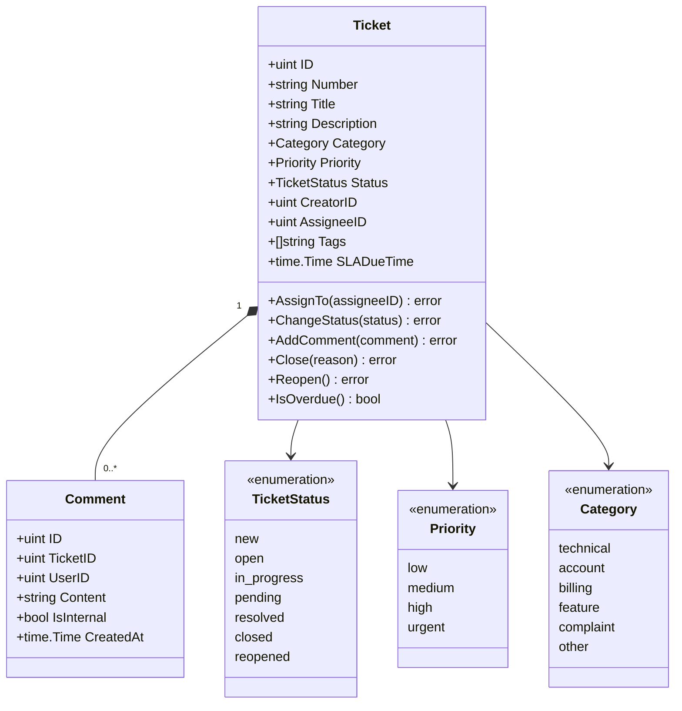
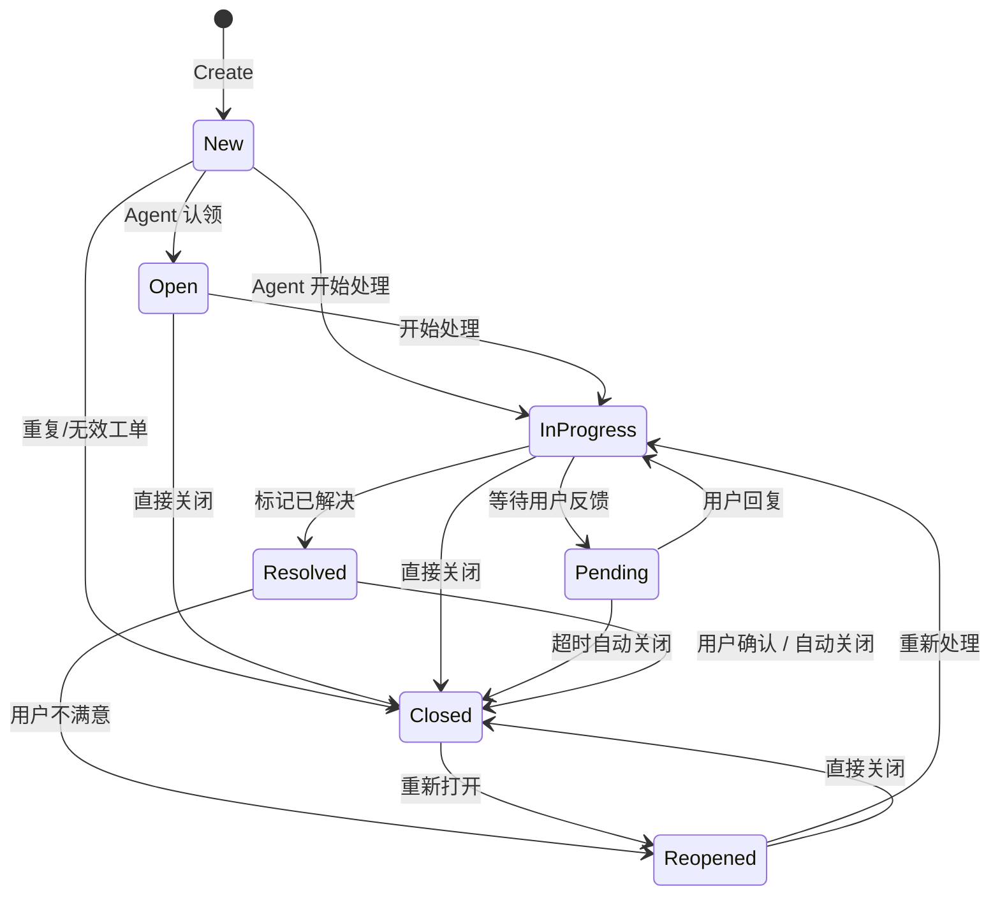
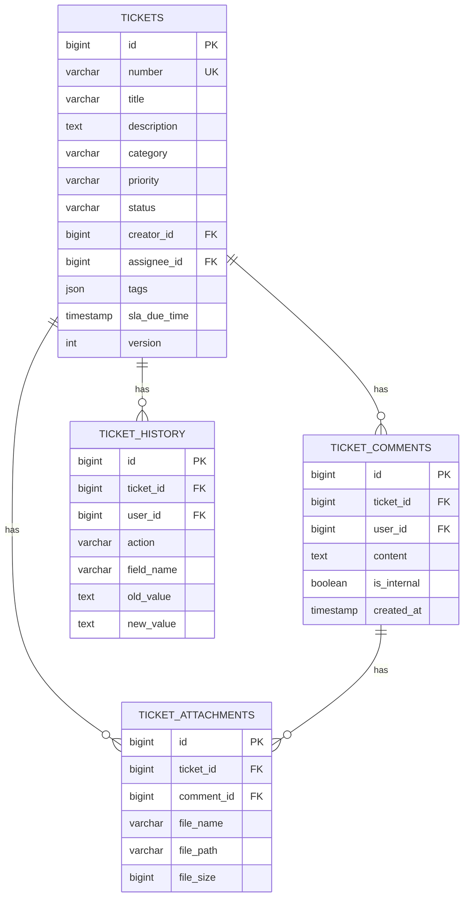

# Ticket System - Complete Design Document
# 工单系统 - 完整设计文档

## 1. System Overview | 系统概述

### 1.1 Purpose | 目标
工单系统（Ticket System）用于管理用户请求、问题报告、功能建议等，提供：
- 多渠道工单创建（API、Web）
- 智能工单分配与路由
- SLA（服务等级协议）管理
- 工作流自动化
- 权限控制与可见性管理
- 统计分析与报表

### 1.2 Architecture | 架构
基于 **Domain-Driven Design (DDD)** 架构：

```
├── Domain Layer (领域层)
│   ├── Ticket (聚合根)
│   ├── Comment (实体)
│   ├── Value Objects (值对象)
│   └── Domain Events (领域事件)
│
├── Application Layer (应用层)
│   └── UseCases (用例)
│
├── Infrastructure Layer (基础设施层)
│   ├── Repository (仓储实现)
│   └── SLA Checker (SLA 检查器)
│
└── Interface Layer (接口层)
    └── HTTP Handlers (REST API)
```

---

## 2. Domain Model | 领域模型

### 2.1 Core Entities | 核心实体

#### Ticket (工单聚合根)
```go
type Ticket struct {
    ID              uint
    Number          string           // 工单号（自动生成，如 T-20241023-0001）
    Title           string           // 标题（必填，1-200字符）
    Description     string           // 描述（必填，最多5000字符）
    Category        Category         // 分类（技术支持/账号问题/功能建议/投诉等）
    Priority        Priority         // 优先级（低/中/高/紧急）
    Status          TicketStatus     // 状态
    CreatorID       uint             // 创建人ID
    AssigneeID      *uint            // 处理人ID（可为空）
    Tags            []string         // 标签
    Metadata        map[string]any   // 元数据（自定义字段）

    // SLA 相关
    SLADueTime      *time.Time       // SLA 到期时间
    ResponseTime    *time.Time       // 首次响应时间
    ResolvedTime    *time.Time       // 解决时间

    // 时间戳
    CreatedAt       time.Time
    UpdatedAt       time.Time
    ClosedAt        *time.Time

    // 关联
    Comments        []Comment        // 评论列表
    Attachments     []Attachment     // 附件列表

    // DDD
    Version         int              // 乐观锁版本
    Events          []DomainEvent    // 领域事件
}
```

#### Comment (评论实体)
```go
type Comment struct {
    ID          uint
    TicketID    uint
    UserID      uint
    Content     string
    IsInternal  bool           // 是否内部备注（仅 Agent/Admin 可见）
    Attachments []Attachment
    CreatedAt   time.Time
}
```

### 2.2 Value Objects | 值对象

#### TicketStatus (工单状态)
```go
type TicketStatus string

const (
    StatusNew         TicketStatus = "new"           // 新建
    StatusOpen        TicketStatus = "open"          // 已打开
    StatusInProgress  TicketStatus = "in_progress"   // 处理中
    StatusPending     TicketStatus = "pending"       // 等待反馈
    StatusResolved    TicketStatus = "resolved"      // 已解决
    StatusClosed      TicketStatus = "closed"        // 已关闭
    StatusReopened    TicketStatus = "reopened"      // 已重开
)
```

#### Priority (优先级)
```go
type Priority string

const (
    PriorityLow      Priority = "low"       // 低优先级
    PriorityMedium   Priority = "medium"    // 中优先级
    PriorityHigh     Priority = "high"      // 高优先级
    PriorityUrgent   Priority = "urgent"    // 紧急
)
```

#### Category (分类)
```go
type Category string

const (
    CategoryTechnical    Category = "technical"      // 技术支持
    CategoryAccount      Category = "account"        // 账号问题
    CategoryBilling      Category = "billing"        // 账单问题
    CategoryFeature      Category = "feature"        // 功能建议
    CategoryComplaint    Category = "complaint"      // 投诉
    CategoryOther        Category = "other"          // 其他
)
```

### 2.3 Domain Model Diagram | 领域模型图



---

## 3. Permission Control | 权限控制

### 3.1 Role Definition | 角色定义

| 角色 | Slug | 描述 |
|------|------|------|
| User | `user` | 普通用户 - 只能创建和查看自己的工单 |
| Agent | `agent` | 客服/处理人员 - 可处理分配给自己的工单 |
| Admin | `admin` | 管理员 - 可查看和管理所有工单 |

### 3.2 Permission Matrix | 权限矩阵

| 操作 | Resource | Action | User | Agent | Admin | 说明 |
|------|----------|--------|------|-------|-------|------|
| 创建工单 | `ticket` | `create` | ✅ | ✅ | ✅ | 所有角色都可创建 |
| 查看自己的工单 | `ticket` | `read` | ✅ | ✅ | ✅ | 基础读取权限 |
| 查看所有工单 | `ticket` | `read_all` | ❌ | ❌ | ✅ | 仅管理员 |
| 更新工单 | `ticket` | `update` | ✅ | ✅ | ✅ | 需可见性检查 |
| 删除工单 | `ticket` | `delete` | ❌ | ❌ | ✅ | 仅管理员 |
| 分配工单 | `ticket` | `assign` | ❌ | ✅ | ✅ | Agent/Admin |
| 关闭工单 | `ticket` | `close` | ❌ | ✅ | ✅ | Agent/Admin |
| 重开工单 | `ticket` | `reopen` | ✅ | ✅ | ✅ | 创建人或处理人 |
| 添加评论 | `ticket` | `comment` | ✅ | ✅ | ✅ | 可见者都可评论 |
| 内部备注 | `ticket` | `internal_note` | ❌ | ✅ | ✅ | 仅 Agent/Admin |

### 3.3 Visibility Rules | 可见性规则

工单可见性由以下规则决定：

```go
// CanViewTicket checks if a user can view a ticket
func CanViewTicket(userID uint, ticket *Ticket, userRoles []string) bool {
    // Rule 1: Admin can view all tickets
    if hasRole(userRoles, "admin") {
        return true
    }

    // Rule 2: Creator can view own tickets
    if ticket.CreatorID == userID {
        return true
    }

    // Rule 3: Assignee can view assigned tickets
    if ticket.AssigneeID != nil && *ticket.AssigneeID == userID {
        return true
    }

    // Rule 4: Participants (commenters) can view
    if isParticipant(userID, ticket.Comments) {
        return true
    }

    return false
}
```

### 3.4 Permission Integration | 权限集成

使用现有的 Casbin 权限系统：

```go
// Middleware example
router.POST("/tickets",
    authMiddleware.RequireAuth(),
    permissionMiddleware.RequirePermission("ticket", "create"),
    ticketHandler.CreateTicket)

router.GET("/tickets/:id",
    authMiddleware.RequireAuth(),
    permissionMiddleware.RequirePermission("ticket", "read"),
    ticketHandler.GetTicket)  // 内部会做可见性检查

router.POST("/tickets/:id/assign",
    authMiddleware.RequireAuth(),
    permissionMiddleware.RequirePermission("ticket", "assign"),
    ticketHandler.AssignTicket)
```

---

## 4. Status Workflow | 状态流转

### 4.1 State Machine | 状态机



### 4.2 Status Transition Rules | 状态转换规则

| 当前状态 | 目标状态 | 允许的角色 | 前置条件 |
|----------|----------|------------|----------|
| New | Open | Agent, Admin | 必须分配处理人 |
| New | InProgress | Agent, Admin | 必须分配处理人 |
| New | Closed | Admin | 需提供关闭原因 |
| Open | InProgress | Assignee, Admin | - |
| InProgress | Pending | Assignee, Admin | 需提供等待原因 |
| InProgress | Resolved | Assignee, Admin | 需提供解决方案 |
| Pending | InProgress | Assignee, Admin | - |
| Pending | Closed | System, Admin | 超时或手动 |
| Resolved | Closed | Creator, Assignee, Admin, System | 确认或自动 |
| Resolved | Reopened | Creator | 需提供重开原因 |
| Closed | Reopened | Creator, Admin | 需提供重开原因 |

---

## 5. SLA Management | SLA 管理

### 5.1 SLA Metrics | SLA 指标

| 指标 | 说明 | 计算方式 |
|------|------|----------|
| Response Time | 首次响应时间 | 从创建到第一条 Agent 评论的时间 |
| Resolution Time | 解决时间 | 从创建到状态变为 Resolved 的时间 |
| Closure Time | 关闭时间 | 从创建到状态变为 Closed 的时间 |

### 5.2 SLA Configuration | SLA 配置

基于优先级的 SLA 时间（工作时间）：

| 优先级 | 响应时间 SLA | 解决时间 SLA |
|--------|--------------|--------------|
| Low | 24小时 | 5个工作日 |
| Medium | 8小时 | 3个工作日 |
| High | 4小时 | 1个工作日 |
| Urgent | 1小时 | 4小时 |

### 5.3 SLA Escalation | SLA 升级

```go
// SLA 违规处理流程
if ticket.IsOverdue() {
    // 1. 发送告警通知
    notifyManager(ticket)

    // 2. 自动升级优先级
    if ticket.Priority != PriorityUrgent {
        ticket.EscalatePriority()
    }

    // 3. 记录 SLA 违规事件
    recordSLAViolation(ticket)

    // 4. 可选：自动重新分配
    if config.AutoReassign {
        reassignToSupervisor(ticket)
    }
}
```

---

## 6. Database Schema | 数据库设计

### 6.1 Tables | 数据表

#### `tickets` 表
```sql
CREATE TABLE `tickets` (
    `id` BIGINT UNSIGNED AUTO_INCREMENT PRIMARY KEY,
    `number` VARCHAR(50) NOT NULL UNIQUE COMMENT '工单号',
    `title` VARCHAR(200) NOT NULL COMMENT '标题',
    `description` TEXT NOT NULL COMMENT '描述',
    `category` VARCHAR(50) NOT NULL COMMENT '分类',
    `priority` VARCHAR(20) NOT NULL COMMENT '优先级',
    `status` VARCHAR(20) NOT NULL COMMENT '状态',

    `creator_id` BIGINT UNSIGNED NOT NULL COMMENT '创建人ID',
    `assignee_id` BIGINT UNSIGNED NULL COMMENT '处理人ID',

    `tags` JSON NULL COMMENT '标签',
    `metadata` JSON NULL COMMENT '元数据',

    `sla_due_time` TIMESTAMP NULL COMMENT 'SLA到期时间',
    `response_time` TIMESTAMP NULL COMMENT '首次响应时间',
    `resolved_time` TIMESTAMP NULL COMMENT '解决时间',

    `version` INT NOT NULL DEFAULT 1 COMMENT '版本（乐观锁）',

    `created_at` TIMESTAMP NOT NULL DEFAULT CURRENT_TIMESTAMP,
    `updated_at` TIMESTAMP NOT NULL DEFAULT CURRENT_TIMESTAMP ON UPDATE CURRENT_TIMESTAMP,
    `closed_at` TIMESTAMP NULL,

    INDEX `idx_number` (`number`),
    INDEX `idx_creator_id` (`creator_id`),
    INDEX `idx_assignee_id` (`assignee_id`),
    INDEX `idx_status` (`status`),
    INDEX `idx_priority` (`priority`),
    INDEX `idx_category` (`category`),
    INDEX `idx_created_at` (`created_at`),
    INDEX `idx_sla_due_time` (`sla_due_time`)
) ENGINE=InnoDB DEFAULT CHARSET=utf8mb4 COLLATE=utf8mb4_unicode_ci;
```

#### `ticket_comments` 表
```sql
CREATE TABLE `ticket_comments` (
    `id` BIGINT UNSIGNED AUTO_INCREMENT PRIMARY KEY,
    `ticket_id` BIGINT UNSIGNED NOT NULL COMMENT '工单ID',
    `user_id` BIGINT UNSIGNED NOT NULL COMMENT '用户ID',
    `content` TEXT NOT NULL COMMENT '评论内容',
    `is_internal` TINYINT(1) NOT NULL DEFAULT 0 COMMENT '是否内部备注',

    `created_at` TIMESTAMP NOT NULL DEFAULT CURRENT_TIMESTAMP,
    `updated_at` TIMESTAMP NOT NULL DEFAULT CURRENT_TIMESTAMP ON UPDATE CURRENT_TIMESTAMP,

    INDEX `idx_ticket_id` (`ticket_id`),
    INDEX `idx_user_id` (`user_id`),
    INDEX `idx_created_at` (`created_at`),

    FOREIGN KEY (`ticket_id`) REFERENCES `tickets`(`id`) ON DELETE CASCADE
) ENGINE=InnoDB DEFAULT CHARSET=utf8mb4 COLLATE=utf8mb4_unicode_ci;
```

#### `ticket_attachments` 表
```sql
CREATE TABLE `ticket_attachments` (
    `id` BIGINT UNSIGNED AUTO_INCREMENT PRIMARY KEY,
    `ticket_id` BIGINT UNSIGNED NULL COMMENT '工单ID',
    `comment_id` BIGINT UNSIGNED NULL COMMENT '评论ID',
    `file_name` VARCHAR(255) NOT NULL COMMENT '文件名',
    `file_path` VARCHAR(500) NOT NULL COMMENT '文件路径',
    `file_size` BIGINT UNSIGNED NOT NULL COMMENT '文件大小（字节）',
    `file_type` VARCHAR(100) NOT NULL COMMENT '文件类型',
    `uploaded_by` BIGINT UNSIGNED NOT NULL COMMENT '上传人ID',

    `created_at` TIMESTAMP NOT NULL DEFAULT CURRENT_TIMESTAMP,

    INDEX `idx_ticket_id` (`ticket_id`),
    INDEX `idx_comment_id` (`comment_id`)
) ENGINE=InnoDB DEFAULT CHARSET=utf8mb4 COLLATE=utf8mb4_unicode_ci;
```

#### `ticket_history` 表（审计日志）
```sql
CREATE TABLE `ticket_history` (
    `id` BIGINT UNSIGNED AUTO_INCREMENT PRIMARY KEY,
    `ticket_id` BIGINT UNSIGNED NOT NULL COMMENT '工单ID',
    `user_id` BIGINT UNSIGNED NOT NULL COMMENT '操作人ID',
    `action` VARCHAR(50) NOT NULL COMMENT '操作类型',
    `field_name` VARCHAR(50) NULL COMMENT '字段名',
    `old_value` TEXT NULL COMMENT '旧值',
    `new_value` TEXT NULL COMMENT '新值',

    `created_at` TIMESTAMP NOT NULL DEFAULT CURRENT_TIMESTAMP,

    INDEX `idx_ticket_id` (`ticket_id`),
    INDEX `idx_created_at` (`created_at`)
) ENGINE=InnoDB DEFAULT CHARSET=utf8mb4 COLLATE=utf8mb4_unicode_ci;
```

### 6.2 ER Diagram | 实体关系图



---

## 7. Domain Events | 领域事件

### 7.1 Event Types | 事件类型

```go
// Ticket Created
type TicketCreatedEvent struct {
    TicketID    uint
    Number      string
    Title       string
    CreatorID   uint
    Priority    string
    Category    string
    Timestamp   time.Time
}

// Ticket Assigned
type TicketAssignedEvent struct {
    TicketID    uint
    AssigneeID  uint
    AssignedBy  uint
    Timestamp   time.Time
}

// Ticket Status Changed
type TicketStatusChangedEvent struct {
    TicketID    uint
    OldStatus   string
    NewStatus   string
    ChangedBy   uint
    Timestamp   time.Time
}

// Ticket Closed
type TicketClosedEvent struct {
    TicketID    uint
    Reason      string
    ClosedBy    uint
    Timestamp   time.Time
}

// Comment Added
type CommentAddedEvent struct {
    TicketID    uint
    CommentID   uint
    UserID      uint
    IsInternal  bool
    Timestamp   time.Time
}

// SLA Violated
type SLAViolatedEvent struct {
    TicketID    uint
    SLAType     string  // "response" or "resolution"
    DueTime     time.Time
    Timestamp   time.Time
}
```

### 7.2 Event Handlers | 事件处理器

```go
// Example: Send notification when ticket is created
type TicketCreatedEventHandler struct {
    notificationService NotificationService
}

func (h *TicketCreatedEventHandler) Handle(event TicketCreatedEvent) error {
    // 1. Notify assigned agent (if any)
    // 2. Send confirmation email to creator
    // 3. Update statistics
    // 4. Trigger auto-assignment if no assignee
}
```

---

## 8. Business Rules | 业务规则

### 8.1 Validation Rules | 验证规则

1. **工单创建**：
   - 标题：必填，1-200字符
   - 描述：必填，最多5000字符
   - 分类：必须是预定义分类之一
   - 优先级：默认为 Medium

2. **工单分配**：
   - 只能分配给有 Agent 或 Admin 角色的用户
   - 分配时自动将状态从 New 改为 Open

3. **状态转换**：
   - 遵循状态机规则
   - 某些状态转换需要额外信息（如关闭原因）

4. **评论**：
   - 内容不能为空
   - 内部备注只有 Agent/Admin 可见

### 8.2 Auto-Assignment Rules | 自动分配规则

```go
// Round-robin 分配策略
func AutoAssign(ticket *Ticket, availableAgents []User) (*User, error) {
    // 1. 筛选在线且未满负荷的 Agent
    activeAgents := filterActive(availableAgents)

    // 2. 按当前工单数升序排序
    sort.Slice(activeAgents, func(i, j int) bool {
        return activeAgents[i].CurrentTickets < activeAgents[j].CurrentTickets
    })

    // 3. 分配给工单数最少的 Agent
    if len(activeAgents) > 0 {
        return &activeAgents[0], nil
    }

    return nil, errors.New("no available agents")
}
```

---

## 9. Integration Points | 集成点

### 9.1 Notification System | 通知系统

工单系统需要发送通知：
- 工单创建通知（创建人）
- 工单分配通知（处理人）
- 新评论通知（相关人员）
- SLA 即将到期告警（处理人、管理员）
- 状态变更通知（创建人、处理人）

通知渠道：
- Email
- 站内消息
- Webhook（可选）

### 9.2 Search & Filter | 搜索与过滤

支持的过滤条件：
- 状态（status）
- 优先级（priority）
- 分类（category）
- 创建人（creator_id）
- 处理人（assignee_id）
- 标签（tags）
- 创建时间范围（created_at）
- SLA 状态（overdue/on_track）

全文搜索字段：
- 标题（title）
- 描述（description）
- 评论内容（comments.content）

---

## 10. Performance Considerations | 性能考虑

### 10.1 Indexing Strategy | 索引策略

核心索引：
- `idx_number`：工单号查询
- `idx_creator_id`：按创建人查询
- `idx_assignee_id`：按处理人查询
- `idx_status`：按状态过滤
- `idx_sla_due_time`：SLA 检查

复合索引：
- `idx_assignee_status`：处理人+状态（常用查询）
- `idx_creator_status`：创建人+状态（我的工单）

### 10.2 Caching Strategy | 缓存策略

缓存内容：
- 工单详情（5分钟 TTL）
- 用户工单列表（1分钟 TTL）
- 统计数据（15分钟 TTL）

缓存失效：
- 工单更新时清除相关缓存
- 评论添加时清除详情缓存

---

## 11. Security Considerations | 安全考虑

### 11.1 Access Control | 访问控制

1. **认证**：所有 API 需要认证
2. **授权**：基于 Casbin 的 RBAC 权限检查
3. **可见性检查**：在 UseCase 层实施
4. **审计日志**：记录所有操作到 `ticket_history` 表

### 11.2 Data Protection | 数据保护

1. **敏感信息**：工单可能包含敏感信息，需控制访问
2. **文件上传**：限制文件类型、大小，扫描恶意文件
3. **SQL 注入**：使用参数化查询
4. **XSS 防护**：前端渲染时转义用户输入

---

## 12. Next Steps | 下一步

1. ✅ **阅读本设计文档**
2. 📋 **查看实施指南**：`TICKET_IMPLEMENTATION_GUIDE.md`
3. 📖 **API 参考**：`TICKET_API_REFERENCE.md`
4. 🔐 **权限配置**：`TICKET_PERMISSION_GUIDE.md`
5. 💻 **开始编码**：按照 35 个任务清单实施

---

## Appendix | 附录

### A. Glossary | 术语表

| 术语 | 英文 | 说明 |
|------|------|------|
| 工单 | Ticket | 用户提交的请求或问题 |
| 聚合根 | Aggregate Root | DDD 中的核心概念 |
| SLA | Service Level Agreement | 服务等级协议 |
| 可见性 | Visibility | 谁可以查看工单的规则 |
| 领域事件 | Domain Event | 领域内发生的重要事件 |

### B. References | 参考资料

1. Casbin 权限系统文档
2. DDD 领域驱动设计模式
3. RESTful API 最佳实践
4. Go 项目最佳实践

---

**文档版本**：v1.0
**最后更新**：2025-01-23
**维护者**：Orris Team
